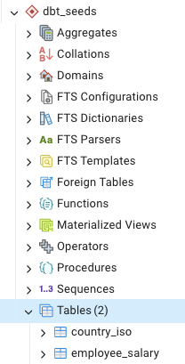
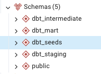
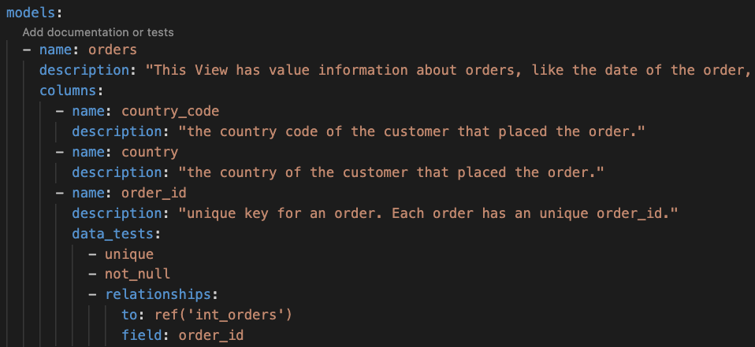
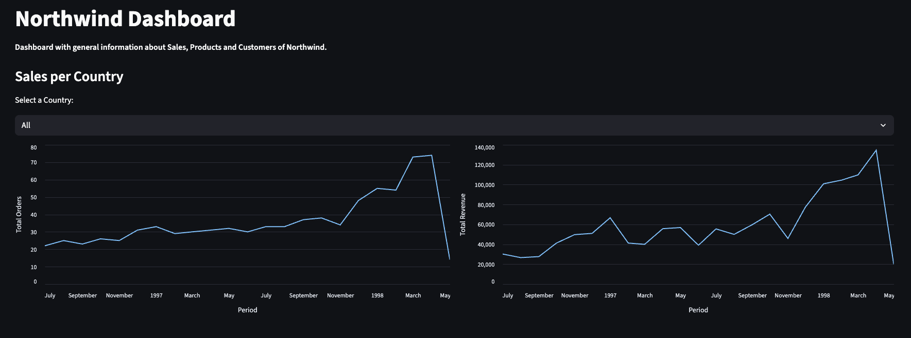
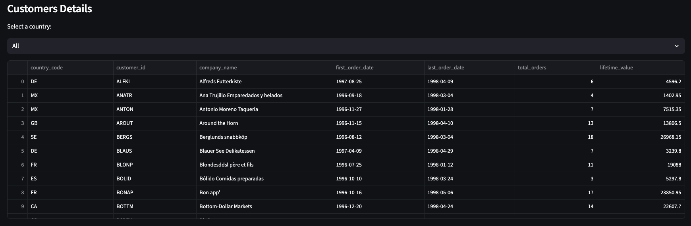
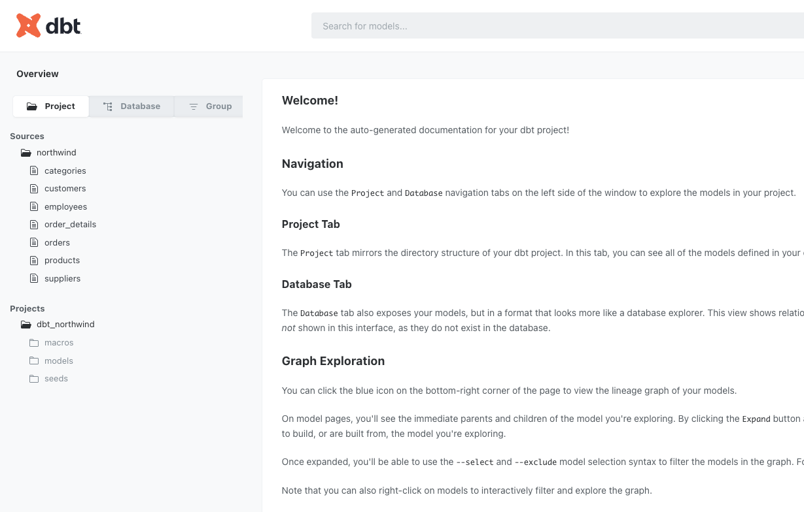
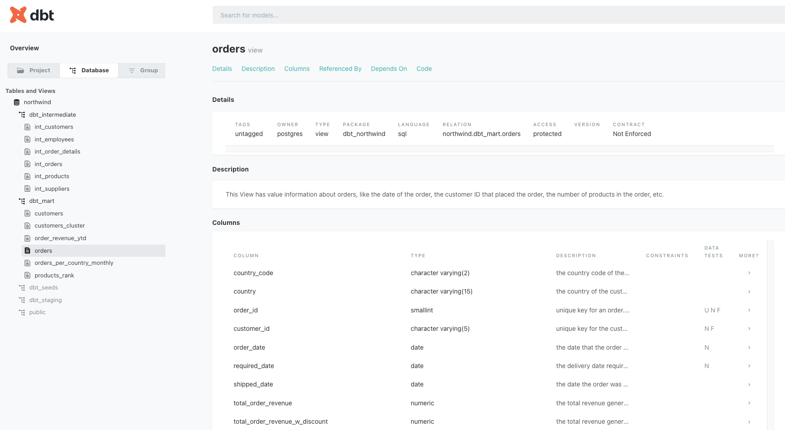
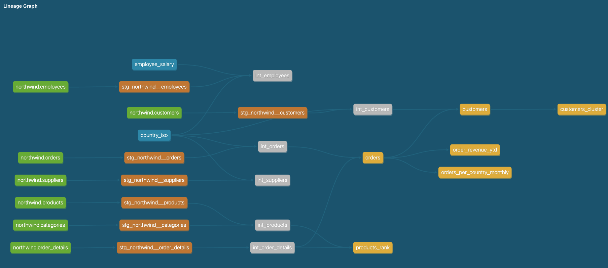
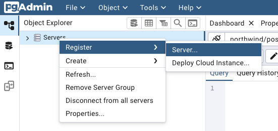

# dbt Core, SQL and Docker Project
Continuing my SQL studies (you can find the second project of this series [here](https://github.com/doegemon/sql_northwind_intermediary/tree/main)), I created this project to put into practice some SQL content and tools I've been studying, as well as using dbt Core to manipulate the database. The main objectives were:
- Use Docker to create a PostgreSQL database without the need to install PostgreSQL + pgAdmin locally
- Use dbt Core to manipulate the database, creating different data layers (staging, intermediate, and mart) with properly formatted models ready for use in analyses and reports.

The solutions provided here can be applied to companies of all sizes and used to solve similar problems that companies face on a daily basis. Through these processes and tools, organizations can save time and resources, and extract valuable insights from their data.

## Database Context
The Northwind database contains the sales data of a company called Northwind Traders, which imports and exports specialty foods from all over the world.

The Northwind database is sourced from the company's ERP, containing customer, order, inventory, purchasing, supplier, shipping, employee and accounting data.

There are a total of 14 tables and the relationships between the tables are shown in the following entity relationship diagram:


## Business Problem

Despite having a well-structured database, the company would like to modernize this base, ensuring harmonized data handling and good data quality, as well as having the data ready for use in analyses and reports.

To do this, I chose to use dbt Core, connecting the tool directly to the database and creating new schemas, views, and tables, as well as documenting everything and testing the use of Views for creating reports with Streamlit.

## Project Stages
1. Create and configure a PostgreSQL database using Docker, and replicating the Northwind tables in this database.
2. Install dbt Core and configure the connection with the PostgreSQL database.
3. Upload some .csv files to the database via ```dbt seeds```
4. Create a schema in the database for each layer recommended in the dbt official documentation (staging, intermediate and mart).
5. Populate these schemas/layers with different models, providing a description of each model and its columns, as well implementing some data tests in the columns to ensure data quality (following the dbt official documentation guidelines).
6. Create a dashboard using Streamlit to test the usage of the models created in the mart layer/schema.
7. Create the documentation of the project using the default documenation tool available in dbt.

## Project Details

### Locally Hosted Database
Using Docker and having the file that creates the tables of the Northwind database, it's possible to host a PostgreSQL database locally, as an alternative to creating a free database on platforms such as Render or AWS.

With the Docker container up and running, you can connect dbt Core to the database (it might be necessary to make some adjustments in the ```profiles.yml``` file) and start manipulating it.

### ```dbt seed```
An excellent feature of dbt is the ability to upload .csv files directly to the database, so that they appear as tables and can be manipulated using SQL, as well as being used in other queries.

In this project, I created a specific schema in the database to store the tables created from two .csv files (one containing country codes, the other containing employees' annual salaries) that are used in the models of this project:



### Models and Layers
Regarding the division of the project into layers and the creation of models, I tried to follow the recommendations provided by dbt on this page [here](https://docs.getdbt.com/best-practices/how-we-structure/1-guide-overview).

So, I divided the project into three layers:
- **staging**: here the models are basically a copy of the original tables we have in the database.
- **intermediate**: here the models are divided by business areas have already undergone some data processing, and there is a combination of some models from the staging layer to create more complex models.
- **mart**: here the models are properly processed and formatted to be used in analyses and reports.

For each layer I created a schema in the database:



I made sure to provide a description for each model created, as well as for the columns in each model. This effort will be reflected in the documentation generated by dbt.

I also implemented some data tests developed by dbt itself to ensure data integrity.

Here is an example of the descriptions and data tests (which are implemented in the ```models.yml``` files):



### Streamlit Dashboard

With the models created in the last layer (mart), I decided to test their usability by creating a dashboard in Streamlit, containing some sales, customer, and product data.

It was also possible to connect Streamlit to the locally hosted database, enabling the construction of the dashboard.

Here are some images of the report:





### dbt Documentation

Finally, another excellent feature of dbt is the ability to generate robust documentation of the models created, as well as the relationships between them.

With the commands ```dbt docs generate``` and ```dbt docs serve```, we can generate interactive documentation hosted locally.

Here are some images of the documentation for this project:







## Project Setup

**Prerequisite**: Install Docker

* [Get Started with Docker](https://www.docker.com/get-started)
* [Install Docker Compose](https://docs.docker.com/compose/install/)

### Docker

1. **Launch Docker Compose** in a terminal, run the command below to launch the services:

    ```
    docker-compose up
    ```

    And wait for the configuration messages.

2. **Launch PgAdmin** Access pgAdmin via the URL [http://localhost:5050](http://localhost:5050), using the password `postgres`.

Set up a new server in pgAdmin:



    **General**:
        * Name: db
    **Connection**:
        * Host name: db
        * Username: postgres
        * Password: postgres

Then select the ```northwind``` database, ```public``` schema, and all the 14 tables will be available to run the queries.

### dbt

After setting up the local hosted database and installing the libraries and packages that are listed in the ```requirements.txt``` file, it's time to populate the database with the models.

But, before running ```dbt run``` to create the models in the database, you need to add/change the profile for this project in the ```profiles.yml``` file (```~/.dbt/profiles.yml```).

The profile should look something like this to connect dbt Core to the locally hosted database:

```
dbt_northwind:
  outputs:
    dev:
      dbname: northwind
      host: localhost
      pass: postgres
      port: 0000 # change for the port that is used on Docker
      schema: public
      threads: 1
      type: postgres
      user: postgres
  target: dev
```

After this adjustment, you can test if the connection worked with the command ```dbt debug```

With the connection working, go to the ```dbt_northwind``` folder and:
1. Execute ```dbt seed``` to create the specific seeds schema and the two tables from the .csv files in the database
2. Execute ```dbt run``` to create the layers schemas and its models in the database.

Also, to see the documentation, as mentioned above, you can execute ```dbt docs generate``` and ```dbt docs serve```

### Streamlit

To see the dashboard, go to the ```streamlit``` folder, add a ```.streamlit``` folder and create the ```secrets.toml``` file.

Inside this file it's necessary to provide the credentials to connect to the locally hosted database. It should look like this:

```
[connections.postgresql]
dialect = "postgresql"
host = "localhost"
port = "0000" # change for the port that is used on Docker
username = "postgres"
password = "postgres"
database = "northwind"
```

After that, return to the ```streamlit```folder and you can execute ```streamlit run dashboard.py``` to create and interact with the dashboard.

## Conclusion
Having the script that creates the Northwind database (```northwind.sql```) and using Docker to avoid having to download the necessary software locally, I was able to use pgAdmin to access a PostgreSQL database.

With access to the database, using dbt Core and its excellent features I was able to solve the business problems proposed, modernizing the Northwind database and ensuring good data quality, as well as having the data ready for use in analyses and reports (tested in the Streamlit dashboard).

Also by using dbt Core I was able to create a robust documentation of the different models and their relationships, which makes easier the usability of the database and the onboarding of new users.

## References
The initial idea of this project is part of the dbt Core Bootcamp from [Jornada de Dados](https://suajornadadedados.com.br/).

The repository used as reference for this project can be found [here](https://github.com/lvgalvao/dbt-core-northwind-project/tree/main).
